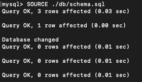
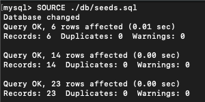
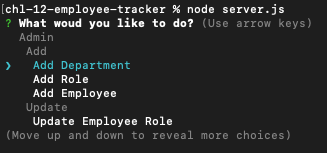
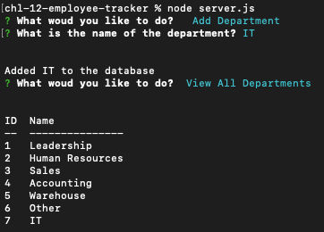
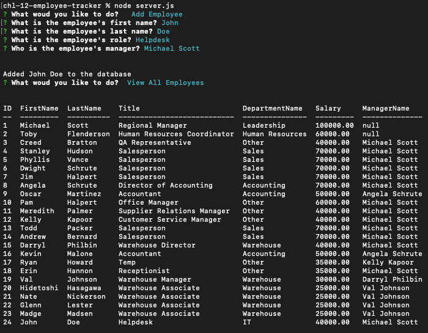
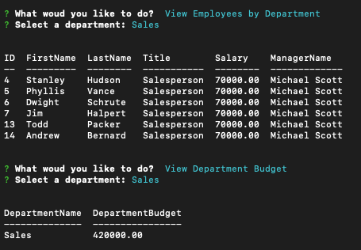

# Challenge 12 - Employee Tracker

## Project Description

As a business owner, you can now manage your company with this simple yet powerful command line application. You can manage different departments, roles, and your employees with very simple Add and Remove options, and view different reports that will give you an overview of the state of your business.

This app uses a MySQL backend and I leveraged my knowledge of relational databases to create the schema. Additionally, I created a Class with `static` methods to return the different SQL statements required for the functionality supported by the app.

The biggest challenge that I faced with this project was MySQL. I have used MS SQL extensively in my career so getting used to MySQL-specific keywords and syntax took me some time to get used to at first. Once I overcame this minor challenge, I felt very comfortable writing the more complex queries and expanding the app to include more options that the user will benefit from.

## Table of Contents
- [Credits](#credits)
- [User Story](#user-story)
- [Acceptance Criteria](#acceptance-criteria)
- [Links](#links)
- [Dependencies](#dependencies)
- [Usage](#usage)
- [Walkthrough](#walkthrough)
- [Screenshots](#screenshots)

## Credits

To seed my database, I used the sample data provided in [tdmitch](https://github.com/tdmitch)'s [DunderMifflin repo](https://github.com/tdmitch/DunderMifflin).

## User Story

```
AS A business owner
I WANT to be able to view and manage the departments, roles, and employees in my company
SO THAT I can organize and plan my business
```

## Acceptance Criteria

```
GIVEN a command-line application that accepts user input
WHEN I start the application
THEN I am presented with the following options: view all departments, view all roles, view all employees, add a department, add a role, add an employee, and update an employee role
WHEN I choose to view all departments
THEN I am presented with a formatted table showing department names and department ids
WHEN I choose to view all roles
THEN I am presented with the job title, role id, the department that role belongs to, and the salary for that role
WHEN I choose to view all employees
THEN I am presented with a formatted table showing employee data, including employee ids, first names, last names, job titles, departments, salaries, and managers that the employees report to
WHEN I choose to add a department
THEN I am prompted to enter the name of the department and that department is added to the database
WHEN I choose to add a role
THEN I am prompted to enter the name, salary, and department for the role and that role is added to the database
WHEN I choose to add an employee
THEN I am prompted to enter the employee’s first name, last name, role, and manager, and that employee is added to the database
WHEN I choose to update an employee role
THEN I am prompted to select an employee to update and their new role and this information is updated in the database 
```
 
## Links

To access the code repository, use the link below:

- ### GitHub Repository URL
    https://github.com/sergiorodriguezdev/chl-12-employee-tracker

## Dependencies

To install the appropriate dependencies, execute the following command from the repo folder:

```
npm install
```

Alternatively, if the `package.json` file is missing, execute the following commands from the repo folder:

```
npm init -y
npm install console.table@0.10.0
npm install inquirer@8.2.4
npm install mysql2@2.2.5
```

## Usage

1. ### Installing the Dependencies
    Clone or download the repo directory to your local machine and install the dependencies as specified in the [Dependencies](#dependencies) section.

2. ### Creating the database schema

    To create the database schema, you must run the `schema.sql` script which will create the database and the tables. To do so, connect to your MySQL server and run the following command:
    ```
    SOURCE <PATH TO REPO DIRECTORY>/db/schema.sql;
    ```
    Replace `<PATH TO REPO DIRECTORY>` with the actual path to the root directory of the repo.

3. ### Seeding the database (OPTIONAL)
    To seed the database, you must first create the database schema (step 1 above), then run the `seeds.sql` script. While connected to your MySQL server, run the following command:
    ```
    SOURCE <PATH TO REPO DIRECTORY>/db/seeds.sql;
    ```
    Replace `<PATH TO REPO DIRECTORY>` with the actual path to the root directory of the repo.

4. ### Updating database connection information
    Open the `dbConnection.js` file in the `config` directory and update the database connection values to match your server configuration:
    + `host`
    + `user`
    + `password`

5. ### Using the app
    Launch the app by executing the following command:
    ```
    node server.js
    ```
    
    You are presented with a list of options to select from:
    + Add Department
    + Add Role
    + Add Employee
    + Update Employee Role
    + Update Employee's Manager
    + Delete Department
    + Delete Role
    + Delete Employee
    + View All Departments
    + View All Roles
    + View All Employees
    + View Employees by Manager
    + View Employees by Department
    + View Department Budget
    + Exit

## Walkthrough

Click [HERE](https://github.com/sergiorodriguezdev/chl-12-employee-tracker/assets/119548442/923be884-e910-403e-8232-a41ff243925f) for a walkthrough of the app.

## Screenshots

### Database Schema and Seeds




### Usage










